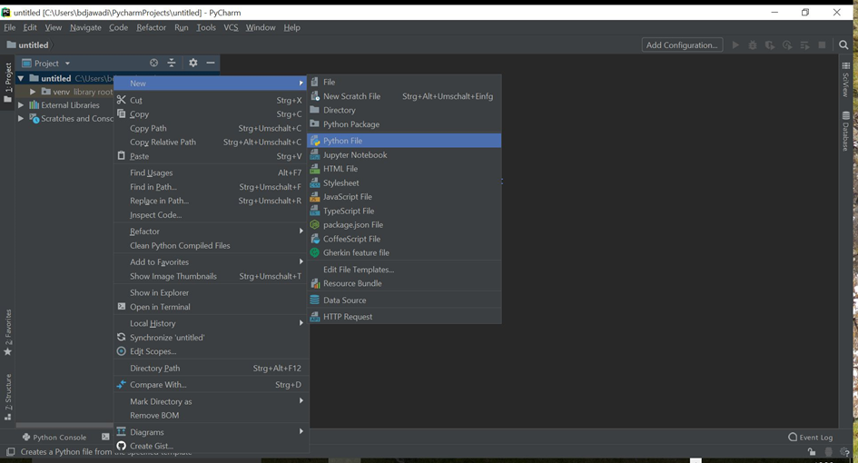

# Getting started with Python
This website is designed to get you started with Python and the IDE PyCharm. After you successfully downloaded 
the different packages and had a first look at the PyCharm IDE you are ready to work yourself through 
selected chapters of the Python e-book and some exercises you all find on the Dropbox share.
Thus, please complete the following steps.

## 1. Download

- [Download Python](https://www.python.org/downloads/)
- [Download Pycharm - Free Community Version](https://www.jetbrains.com/de-de/pycharm/download)

The download of these two items are straightforward and should proceed as any other software you have installed on your computer. Python is the programming language that needs to be installed on your computer. We recommend PyCharm because it is a nice programming environment to execute any Python code (and program more complex projects). Otherwise you would have to use a text editor and a console which would prove to be extremely old-school and not so user friendly.

## 2. Working with PyCharm - A very brief starter

Once you start PyCharm you should see the following starting screen. On the left, you find a history of your previous projects and on the right you have several options. When you start from scratch you first have to create a project where you afterwards can insert all your single Python files.

When starting a new project, a virtual environment is always created automatically, so that the installations made for this environment are not system-wide but limited.
You do not need to worry about this at the beginning, it is only which interpreter is used and that will be the one you have just installed. (In the line Base interpreter choose the location of the Python version you just installed)

Below you see the working screen. In the left panel you see information on your project and all the current files and subfolders. The main window is the one where the content of a file is shown to you and where you write your code

Create a new (empty) Python file. Right-click on your project on the left panel (in this example it is called untitled). Choose from the menu New->Python file. Another dialogue window will open where you can name the file. After that the empty Python file will open in a new tab in the main window.

 

Now you are ready to program and execute Python code. Press your cursor somewhere in the main window and start typing. Whenever you are finished with your code and you want to execute it: place the cursor somewhere in the main window. Right-click on your mouse and select “Run <filename>.py”. Another window, the console window, will open at the bottom and display the outcome of the code execution

To save the content of your current Python file go to the left panel, right-click on your <filename.py> file and say save. Once you execute the code the file will be saved automatically.

That’s it for the moment. As you can see PyCharm is a very powerful tool. However at this stage you only need to know how to create a project, create an empty Python file, write your code in the main window, and execute it and view the outcome in the console window. Now you are set to proceed to step 3.

#### Interpreter 
If PyCharm didn't find the Python interpreter itself, you will get a warning. 

To change it open the Setting (File -> Settings). 

Go to Project: Name of your project and on Python interpreter

There you choose the one installed.
## 3. Begin your Python journey	

Please work yourself through selected chapters of the e-book "Automate the Boring Stuff with Python" by Al Sweigart which you find on the Dropbox share. This e-book is for studying purposes only and must not be distributed to other people. 

Please have a closer look at the chapters Introduction and Chapters 1-4. You do not need to install anything in addition and you do not need to work on any of the exercises in the book. For executing the code that is presented in the book, use your PyCharm software. Just create a project, create for each chapter a new Python file, type in the code and execute it.  You should see in your console window the same outcome as in the book. Especially for beginners it is quite helpful to type the code yourself and execute it, instead of just having a look at it. 

After reading the selected chapters, you should be ready to test your acquired knowledge on some exercises you find in the Dropbox folder. Please copy the folder "Tasks to practice" on your local drive. Then, in PyCharm choose File->Open Project and select the folder (or when you are at the starting screen choose Open Project and select the folder). Then you will see a collection of Python files. In each Python file we have a programming task for you. Some of the tasks may be easy, others harder. Try to solve as much of the tasks as possible and execute your code to see if you correctly solved them. To make sure that you do not skip to the solutions too quickly, the solution to the tasks will be uploaded not earlier than one week before the start of the course.

## 4. Additional Reading (only optional) 

##### Reading 
- [Automate the boring stuff with Python (Web Version)](https://automatetheboringstuff.com/)

#### Course 
- [Learn Python interactive Tutorial](https://www.learnpython.org/)  
- [Studytonight](https://www.studytonight.com/python/)
- [FreeCodeCamp - Scientific Computing with Python](https://www.freecodecamp.org/learn/scientific-computing-with-python/)
##### Videos

- [One big video lecture](https://www.youtube.com/watch?v=_uQrJ0TkZlc)
- [Playlist](https://www.youtube.com/watch?v=Z1Yd7upQsXY&list=PLBZBJbE_rGRWeh5mIBhD-hhDwSEDxogDg&index=1)

##### Games
- [CodingGame](https://www.codingame.com/start)
