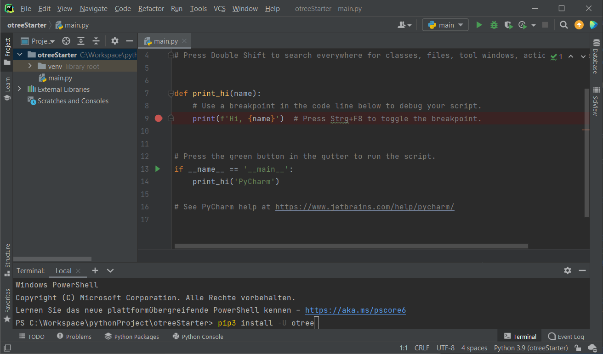
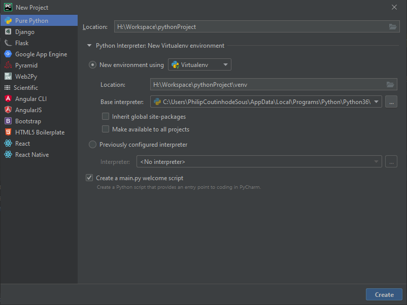
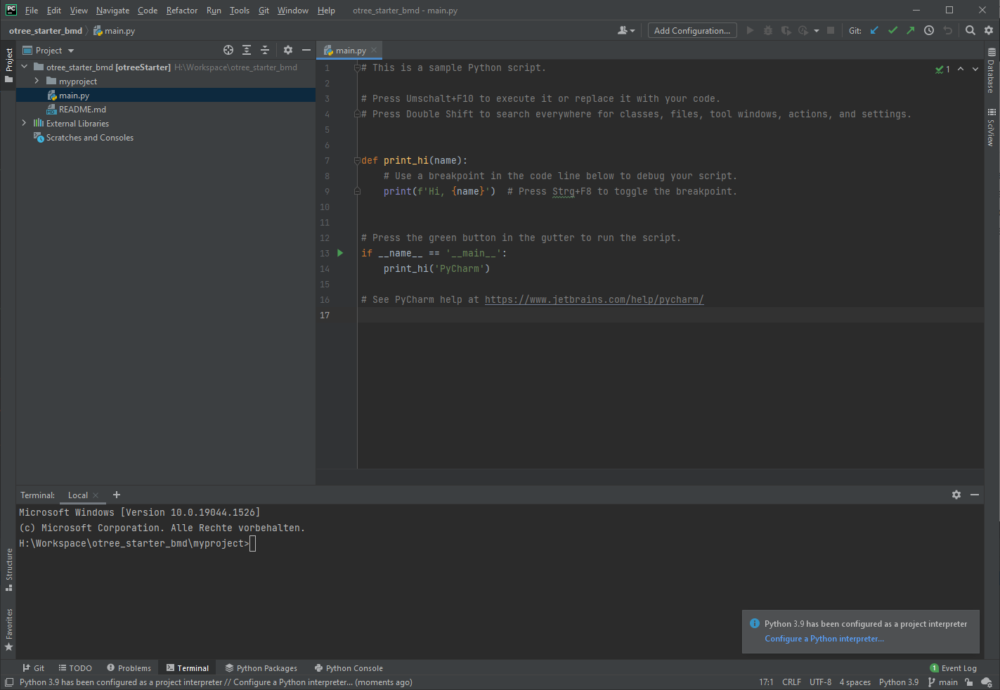
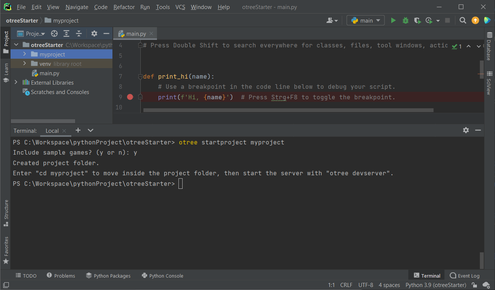
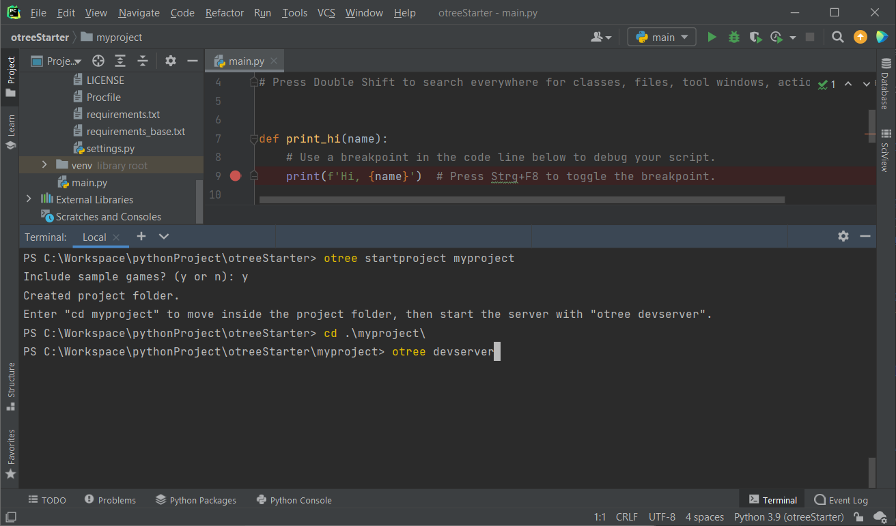

# Introduction to Otree

This small project is a starting point for Dr. Behnud Mir Djawadi's course on getting started for Otree.
For this, resources and tools are shown with which you can start learning 

## Getting started

### Prerequisites 

- [Download Python](https://www.python.org/downloads/)
- [Download Pycharm - Community](https://www.jetbrains.com/de-de/pycharm/download) 

Use the latest version of Python.

Most beginner materials on Python are made only in text files and with the console. But you can do everything directly in pycharm and get used to the environment.

 Python for Beginners - Material

To get started you need some basic Python knowledge, for that there are several materials here all aimed at complete newcomers to Python programming. The offers here are only listed because there are different learning types, please use what you find best.

##### Reading
- [Automate the boring stuff with Python](https://automatetheboringstuff.com/)

#### Course 
- [Learn Python interactive Tutorial](https://www.learnpython.org/)  
- [Studytonight](https://www.studytonight.com/python/)
- [FreeCodeCamp - Scientific Computing with Python](https://www.freecodecamp.org/learn/scientific-computing-with-python/)
##### Videos

- [One big video lecture](https://www.youtube.com/watch?v=_uQrJ0TkZlc)
- [Playlist](https://www.youtube.com/watch?v=Z1Yd7upQsXY&list=PLBZBJbE_rGRWeh5mIBhD-hhDwSEDxogDg&index=1)

##### Games
- [CodingGame](https://www.codingame.com/start)

### Otree 

1. [Otree Documentation](https://otree.readthedocs.io/en/latest/install.html)
2. There is a page for developing [otree experiments](https://www.otreehub.com/). We use the text-editor variant here.

#### Usage of Pycharm
1. First you see a window like this, with all your projects, most likely thats empty

2. Start a new Project and name it so you will recognize it in the future 
3. The next window will have a main.py
   1. on the left you see the project structure, with every file and folder in it.
   2. on the right there is the area you program in.
   3. on the bottom you have additional windows, most of the times you use it for the 'Problems' or 'Terminal' window
4. open the terminal on the bottom of pycharm 
5. (optional) if not already done , install otree via 'pip3 install -U otree'
6. now type in the terminal "otree startproject <myproject>" , where my project is the name of your project (the brackets are not to be used in this command, its just to show that you should change the myproject name)
7. on the question if you want to include sample games say yes (type y and enter)
. After a few seconds there should be the project folder in the tree above 

8. move with the terminal into the projectfolder with 'cd myproject" 
9. you can start otree now via 'otree devserver'
10. follow the link in the terminal - it is [localhost:8000 normally](http://localhost:8000/) 
11. you started your otree testserver on your computer

##### Getting started with simple survey

[Tutorial simple survey](https://otree.readthedocs.io/en/latest/tutorial/part1_texteditor.html)

Click yourself through this tutorial to get an idea of how to work with otree in general.
Every step is described and in the end you got yourself a basic survey to work on in the future 